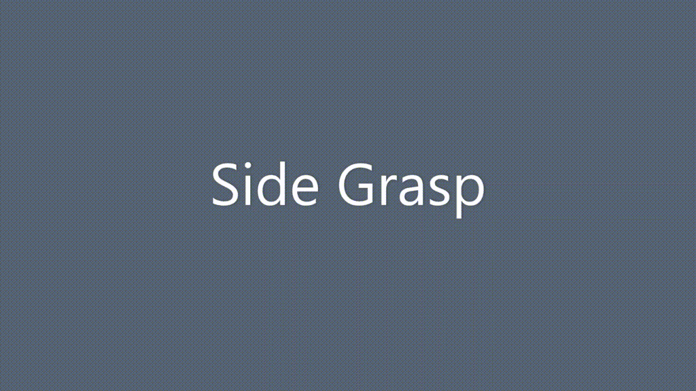

Sandbox to Simulate Grasping in Gazebo with the iCub
====================================================

[](https://doi.org/10.5281/zenodo.3999468)
[](https://zenhub.com)
[](https://github.com/robotology/community)

## [🚶🏻‍♂️ Walkthrough][1]
This sandbox allows you to experiment with iCub performing basic object grasping within the Gazebo simulator.

## ☁ Instructions to run the sandbox on the web
We make use of the [Gitpod Cloud IDE](https://gitpod.io) as infrastructure. Find out more on [YARP-enabled Gitpod workspaces][2].

Here's below a quick how-to guide; please, refer to the section [🚶🏻‍♂️ Walkthrough][1] for an extensive video tutorial 🎥

1. To get started with the sandbox, click on the following badge:

    [][3]

1. Once the sandbox workspace is ready, build and install the project:
    ```console
    cd /workspace/icub-gazebo-grasping-sandbox 
    mkdir build && cd build
    cmake ../
    sudo make install
    ```
1. From within Gitpod, open up the browser at the port `6080` to get to the workspace desktop GUI.
1. In the desktop GUI, open a terminal and run the grasping experiment:
   ```console
   icub-grasp.sh
   ```
1. If needed, you can clean up hanging resources by specifying the option `clean`:
   ```console
   icub-grasp.sh clean
   ```

<div align="center">
  
</div>

## [🔽 Instructions to run the sandbox locally](./dockerfiles/README.md)

## [🏬 Instructions to run the sandbox on the Robot Bazaar](https://robot-bazaar.iit.it/applications/14)

## ℹ Manual installation
If you want to install the sandbox manually to perform specific customization (e.g. enable GPU), please refer to the recipe contained in the [**`Dockerfile`**](./dockerfiles/Dockerfile).

## 📚 Cite the sandbox
In case you use this sandbox for your work, please **quote it within any resulting publication** by citing this [repository](./CITATION.cff) and/or the paper where you can find the **original implementation of the grasping method**:
- P. D. H. Nguyen, F. Bottarel, U. Pattacini, M. Hoffmann, L. Natale and G. Metta, "_Merging Physical and Social Interaction for Effective Human-Robot Collaboration_," 2018 IEEE-RAS 18th International Conference on Humanoid Robots (Humanoids), Beijing, China, 2018, pp. 1-9, doi: [10.1109/HUMANOIDS.2018.8625030](https://doi.org/10.1109/HUMANOIDS.2018.8625030).

<details>
<summary>🔘 Click to show other papers describing foundamental components used in the sandbox</summary>
<b>Motion control of iCub in the operational space:</b>
<ul>
  <li>U. Pattacini, F. Nori, L. Natale, G. Metta and G. Sandini, "<i>An experimental evaluation of a novel minimum-jerk cartesian controller for humanoid robots</i>," 2010 IEEE/RSJ International Conference on Intelligent Robots and Systems, Taipei, 2010, pp. 1668-1674, doi: <a href="https://doi.org/10.1109/IROS.2010.5650851">10.1109/IROS.2010.5650851</a>.</li>
  <li>A. Roncone, U. Pattacini, G. Metta and L. Natale, "<i>A Cartesian 6-DoF Gaze Controller for Humanoid Robots</i>", Proceedings of Robotics: Science and Systems, Ann Arbor, MI, June 18-22, 2016, doi: <a href="https://doi.org/10.15607/RSS.2016.XII.022">10.15607/RSS.2016.XII.022</a>.</li>
</ul>
<b>Interoperability between iCub and Gazebo:</b>
<ul>
  <li>M. Hoffman E., S. Traversaro, A. Rocchi, M. Ferrati, A. Settimi, F. Romano, L. Natale, A. Bicchi, F. Nori and N. G. Tsagarakis, "<i>Yarp Based Plugins for Gazebo Simulator</i>". In: Hodicky J. (eds) Modelling and Simulation for Autonomous Systems. MESAS 2014. Lecture Notes in Computer Science, vol 8906. Springer, Cham. pp 333-346, doi: <a href="https://doi.org/10.1007/978-3-319-13823-7_29">10.1007/978-3-319-13823-7_29</a>.
</ul>
</details>

## [📃 List of works built on the sandbox][4]

### 👨🏻‍💻 Maintainers
This repository is maintained by:

| | |
|:---:|:---:|
| [](https://github.com/pattacini) | [@pattacini](https://github.com/pattacini) |

### 🙏 Acknowledgements
- This sandbox was made possible thanks to [xEnVrE](https://github.com/xEnVrE) of the [HSP@IIT][5] group for his contributions to [`robotology/icub-models`][6] on simulating visuo-manipulation tasks in Gazebo.
- Inspired by the simplified simulation environment available in [`shadow-robot/smart_grasping_sandbox`][7].

### 🆕 Contributing
Check out our [CONTRIBUTING guidelines](./.github/CONTRIBUTING.md).

[1]: https://robotology.github.io/icub-gazebo-grasping-sandbox
[2]: https://github.com/robotology/community/discussions/459
[3]: https://gitpod.io/from-referrer
[4]: https://robotology.github.io/icub-gazebo-grasping-sandbox/building-on-sandbox.html
[5]: https://www.iit.it/research/lines/humanoid-sensing-and-perception
[6]: https://github.com/robotology/icub-models
[7]: https://github.com/shadow-robot/smart_grasping_sandbox
