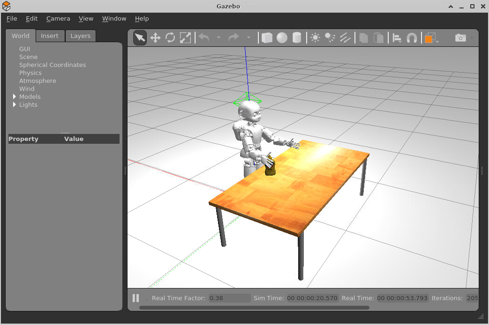

Sandbox to Simulate Grasping in Gazebo with the iCub
====================================================

## 🌐 Instructions to run the sandbox on the web

We make use of the [Gitpod Cloud IDE](https://gitpod.io) as infrastructure. Find out more on [YARP-enabled Gitpod workspaces][1].

1. To get started with the sandbox, click on the following badge:

    [][2]

1. Once the sandbox workspace is ready, build and install the project:
    ```sh
    $ cd /workspace/icub-gazebo-grasping-sandbox 
    $ mkdir build && cd build
    $ cmake ../
    $ make install
    ```
1. From within Gitpod, open up the browser at the port `6080`.
1. Open a terminal and run the grasping experiment:
   ```sh
   $ icub-grasp.sh
   ```

<p align="center">
    
</p>

## [🐳 Instructions to run the sandbox locally](./dockerfiles)

### 🙏 Acknowledgements
Special thanks go to [xEnVrE](https://github.com/xEnVrE) for his help on simulating visuomanipulation tasks in Gazebo.

### 🆕 Contributing
Check out our [CONTRIBUTING guidelines](./.github/CONTRIBUTING.md).

[1]: https://spectrum.chat/icub/technicalities/yarp-enabled-gitpod-workspaces-available~73ab5ee9-830e-4b7f-9e99-195295bb5e34
[2]: https://gitpod.io/#https://github.com/icub-tech-iit/icub-gazebo-grasping-sandbox
