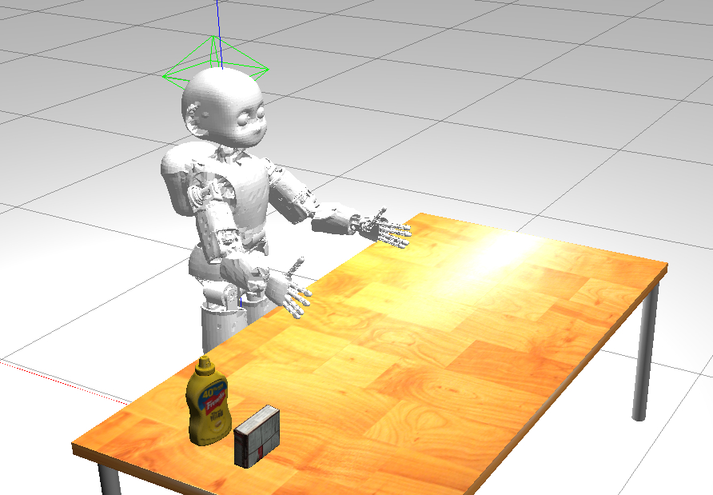
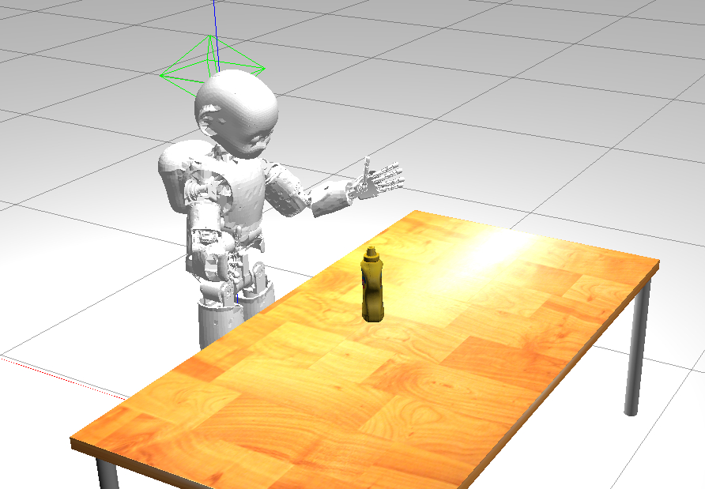
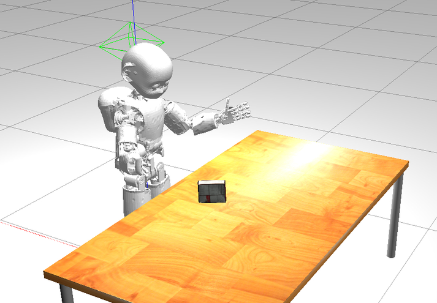
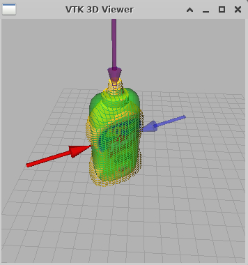
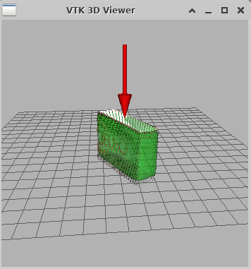

🚶🏻‍♂️ Walkthrough
==============

## Video tutorial on how to run the sandbox in Gitpod

| |
| :---: |
| <video controls width="720" height="405" controls> <source type="video/mp4" src="./assets/videos/gitpod.mp4#t=00:00:01"> </video> |

## Intro
This sandbox aims to illustrate how iCub can perform grasping within the Gazebo simulation environment.

To this end, we do implement a simple grasping policy that allows representing the partial point cloud
of the object observed by the robot as a [**superquadric**][1], which in turn is used to determine
through geometric reasoning a bunch of suitable 3D poses from where to attempt side or top grasps.

Relevantly, this policy is built on the original idea published in [Nguyen _et al._](#references). Nowadays,
autonomous grasping is often achieved by means of advanced _end-to-end deep-learning techniques_;
however, methods that resort to (even straightfoward) **geometric rules** to find out grasp candidates
can still have their say as in e.g. [Zapata-Impata _et al._](#references).

The main stages of the pipeline are briefly outlined in the sections reported hereinafter.

## Under the hood

### 1. Startup
There are two objects located on the table in front of iCub, which are taken from the [YCB dataset][4].
The objective is to let iCub grasp them one at time. Therefore, one of the two objects is randomly
selected and presented to the robot.

The second object gets simply removed from the simulated world in order to spare computations from the
standpoint of the physics engine. In fact, as it turns out evident while running the sandbox, Gazebo is
pretty demanding so that the resources made available from within the Gitpod workspace are not sufficient
to let the simulation flow smoothly. You may consider getting around these limitations by [running the
sandbox locally on your PC][5].

A couple of considerations:
- The two YCB objects have been identified to own the suitable geometric properties that elicit side and top grasps separately.
- For the sake of simplicity and clarity, the code has been designed such that the pipeline can run only in **one-shot mode**,
  that is, once a grasp is done, you have to launch the demo again from the beginning to repeat the experiment.

| |
| :---: |
| iCub in front of the table at startup |
|  |
| iCub presented with the mustard bottle |
|  |
| iCub presented with the pudding box |
|  |

### 2. Scene segmentation and superquadric fitting
The 3D point cloud of the scene acquired from the iCub cameras is processed in order to segment out the
object from the table using a naive [**RANSAC**][6]. The resulting partial point cloud of the object is used
to construct a compact **3D representation based on superquadrics** by recruiting a nonlinear fitting.
This operation is performed by the external module [**`find-superquadric`**][7]. In particular, the
superquadric allows us to get a good guess of how the shape of the object may be completed in the hidden
area, clearly leveraging on the hypothesis of symmetry.

Here below you can find two examples of superquadric representations (the greenish surface) superimposed
on the point clouds of the objects:

| | |
| :---: | :---: |
|  |  |

### 3. Evaluation of cardinal-points-grasp candidates 
In the figures above you should have also noticed the presence of blue and red arrows. Those arrows depict
how effectively iCub will be performing side or top grasps from the indicated approaching directions.
Blue and red arrows correspond to grasps executed with the right and the left hand, respectively:
the bigger and the less transparent is the arrow, the better the grasp is supposed to be.

The grasp candidates are always anchored to the so-called **cardinal points** of the superquadric, which are
those points located at the intersections between the principal axes of the superquadric and its surface.

To rank grasp candidates, we take into account reachability as well as several geometric characteristics of
the object and the iCub hand.

To find out more on how **candidates ranking** takes place, please refer to the algorithm in [Nguyen _et al._](#references).

| Examples of side and top grasps |
| :---: |
| <video controls autoplay loop width="720" height="405" controls> <source type="video/mp4" src="./assets/videos/collection.mp4"> </video> |

|  What happens if iCub does not find good candidates ❔ |
| :---: |
| <video controls width="720" height="405" controls> <source type="video/mp4" src="./assets/videos/shrug.mp4"> </video> |

## Outro
Enjoy this sandbox as a playground to exercise with iCub's manipulation tasks in Gazebo 🤖

Also, don't hesitate to [**fork the sandbox**][8] to build on top new interesting methods 🧪
and don't forget to let us know about your progress 📢 For this, take a look at the 📃
[**list of works**][9] ✨ that we know were built on the sandbox.

For your convenience, the latest release of the sandbox codebase can be referenced using this DOI:

## References
- P. D. H. Nguyen, F. Bottarel, U. Pattacini, M. Hoffmann, L. Natale and G. Metta, "_Merging Physical and Social Interaction for Effective Human-Robot Collaboration_," 2018 IEEE-RAS 18th International Conference on Humanoid Robots (Humanoids), Beijing, China, 2018, pp. 1-9, doi: [10.1109/HUMANOIDS.2018.8625030][2].
- B. S. Zapata-Impata, P. Gil, J. Pomares and F. Torres, "_Fast geometry-based computation of grasping points on three-dimensional point clouds_," 2019 International Journal of Advanced Robotic Systems, doi: [10.1177/1729881419831846][3].

[1]: https://en.wikipedia.org/wiki/Superquadrics
[2]: https://doi.org/10.1109/HUMANOIDS.2018.8625030
[3]: https://doi.org/10.1177/1729881419831846
[4]: https://www.ycbbenchmarks.com/object-models
[5]: https://github.com/robotology/icub-gazebo-grasping-sandbox/blob/master/dockerfiles/README.md
[6]: https://it.wikipedia.org/wiki/RANSAC
[7]: https://github.com/robotology/find-superquadric
[8]: https://github.com/robotology/icub-gazebo-grasping-sandbox
[9]: ./building-on-sandbox.md
